============
ColorBarsUHD
============

.. _ColorBarsUHD:

**ColorBarsUHD** generates a video clip containing UHD/HDR colour bars
conforming to `Rec. ITU-R BT.2111-3`_ (05/2025). Three signal variants
are available via the ``mode`` parameter, corresponding to the three
pattern subtypes defined in BT.2111-3.

For SDR color bars see :ref:`ColorBars <ColorBars>` and :ref:`ColorBarsHD <ColorBarsHD>` filters.

By default, a 3840×2160, RGBP10, limited-range, 29.97 fps, 1-hour-long
clip is produced. The height is automatically derived from the width to
maintain the 16:9 aspect ratio of the standard 3840×2160 reference.

Audio is also generated — see the audio section in
:doc:`ColorBars / ColorBarsHD <colorbars>` for details.

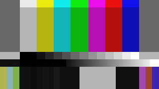

   ColorBarsUHD mode=0: HLG narrow range (BT.2111-3 Table 2).
   75% primary colour bars. RGBP10, limited range.
   *(Rendered to 8-bit for display purposes.)*

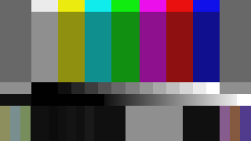

   ColorBarsUHD mode=1: PQ narrow range (BT.2111-3 Table 3).
   58% primary colour bars with 100% top row. RGBP10, limited range.
   *(Rendered to 8-bit for display purposes.)*

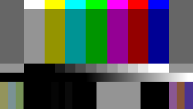

   ColorBarsUHD mode=2: PQ full range (BT.2111-3 Table 4).
   58% primary colour bars with 100% top row. RGBP10, full range.
   *(Rendered to 8-bit for display purposes.)*

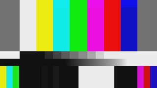

   ColorBarsUHD mode=0 (HLG) converted to SDR/BT.709 using fmtconv
   display-referred path (ITU Fig. 12), ``lws=1000`` (γ=1.2,
   reference 1000 cd/m² display).
   *(Rendered to 8-bit for display purposes.)*

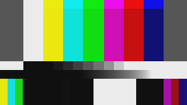

   ColorBarsUHD mode=0 (HLG) converted to SDR/BT.709 using fmtconv
   display-referred path, ``lws=10000`` (γ=1.702 per fmtconv formula,
   darker SDR result; demonstrates the effect of the ``lws`` parameter).
   *(Rendered to 8-bit for display purposes.)*

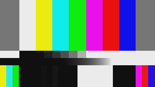

   ColorBarsUHD mode=1 (PQ narrow) converted to SDR/BT.709 using
   fmtconv display-referred path (raw mapping without tone mapping).
   *(Rendered to 8-bit for display purposes.)*

|clearfloat|

The six example images above are generated by the following script.
``ImageWriter`` writes frames 0–5 as PNG files to the ``pictures/``
subfolder. The fmtconv ``lws`` parameter on the first HLG transfer is
the only ``lw``-family parameter with any effect: it sets the HLG system
gamma (γ=1.2 at lws=1000, the BT.2100 reference). All ``lw`` parameters
on PQ transfers and on any non-first fmtconv transfer are silently ignored.

.. code-block:: none

    src_hlg       = ColorBarsUHD(width=320, height=180, pixel_type="RGBP10", mode=0)
    src_pq_narrow = ColorBarsUHD(width=320, height=180, pixel_type="RGBP10", mode=1)
    src_pq_full   = ColorBarsUHD(width=320, height=180, pixel_type="RGBP10", mode=2)

    # HLG → SDR, lws=1000 → γ=1.2 (reference 1000 cd/m² display)
    src_hlg.ConvertBits(32, fulld=true)
    fmtc_transfer(transs="hlg", transd="linear", sceneref=false,
        \ fulls=true, fulld=true, lws=1000)
    fmtc_primaries(prims="2020", primd="709")
    fmtc_transfer(transs="linear", transd="1886", fulls=true, fulld=true)
    sdr_hlg = last.ConvertBits(10, fulld=false)

    # HLG → SDR, lws=10000 → γ=1.702 (fmtconv formula; darker; shows lws effect)
    src_hlg.ConvertBits(32, fulld=true)
    fmtc_transfer(transs="hlg", transd="linear", sceneref=false,
        \ fulls=true, fulld=true, lws=10000)
    fmtc_primaries(prims="2020", primd="709")
    fmtc_transfer(transs="linear", transd="1886", fulls=true, fulld=true)
    sdr_hlg_mod = last.ConvertBits(10, fulld=false)

    # PQ narrow → SDR (display-referred, raw mapping; all lw ignored)
    src_pq_narrow.ConvertBits(32, fulld=true)
    fmtc_transfer(transs="2084", transd="linear", sceneref=false,
        \ fulls=true, fulld=true)
    fmtc_primaries(prims="2020", primd="709")
    fmtc_transfer(transs="linear", transd="1886", fulls=true, fulld=true)
    sdr_pq = last.ConvertBits(10, fulld=false)

    function ToRGB8(clip c) { return c.ConvertBits(8).ConvertToRGB24() }

    Interleave(
        \ ToRGB8(src_hlg), ToRGB8(src_pq_narrow), ToRGB8(src_pq_full),
        \ ToRGB8(sdr_hlg), ToRGB8(sdr_hlg_mod),   ToRGB8(sdr_pq))
    Trim(0, 5).ImageWriter("pictures/colorbarsuhd_", type="png")

.. rubric:: Syntax and Parameters

::

    ColorBarsUHD (int "width", int "height", string "pixel_type",
                  bool "staticframes", int "mode")

.. describe:: width, height

    Set the size of the returned clip. The height defaults to
    ``width × 2160 / 3840``, preserving the standard 16:9 aspect ratio.
    Standard resolutions supported by the ITU reference geometry are
    1920×1080 (2K), 3840×2160 (4K) and 7680×4320 (8K), but any width
    is accepted and the geometry is scaled accordingly.

    Default: 3840, 2160

.. describe:: pixel_type

    Set the colour format of the returned clip. The primary intended
    formats are:

    - ``"RGBP10"`` — planar RGB 10-bit (default, matches ITU reference)
    - ``"RGBP12"`` — planar RGB 12-bit

    The following formats are also supported:

    - Integer: ``"RGBP8"``, ``"RGBP14"``, ``"RGBP16"``
    - Float: ``"RGBPS"`` (32-bit float)
    - YUV 4:4:4: ``"YUV444P8"``, ``"YUV444P10"``, ``"YUV444P12"``,
      ``"YUV444P14"``, ``"YUV444P16"``, ``"YUV444PS"``

    YUV output uses the **BT.2020 NCL** matrix (consistent with BT.2111 recommendations)
    BT.2020 CL (constant luminance) is intentionally not used, as CL
    encoding computes luma from linear RGB rather than gamma-encoded RGB.

    Default: ``"RGBP10"``

.. describe:: staticframes

    If set to false, all frames are generated individually. If true
    (default), a single static frame is computed once and served for
    every frame request.

    Default: true

.. describe:: mode

    Selects the signal variant as defined in BT.2111-3:

    - ``0`` — **HLG narrow range** (Table 2). Primary colour bars at
      75% (code 721 at 10-bit). Transfer: ARIB B67 (HLG).
      Range: limited (64–940 at 10-bit) for 8-16 bits. 32-bit float output is always full-range.
    - ``1`` — **PQ narrow range** (Table 3). Primary colour bars at
      58% (code 573 at 10-bit), 100% top row. Transfer: ST 2084 (PQ).
      Range: limited (64–940 at 10-bit) for 8-16 bits. 32-bit float output is always full-range.
    - ``2`` — **PQ full range** (Table 4). Primary colour bars at 58%
      (code 594 at 10-bit), 100% top row. Transfer: ST 2084 (PQ).
      Range: full (0–1023 at 10-bit).

    Default: 0 (HLG narrow range)

Frame Properties
----------------

ColorBarsUHD sets the following frame properties on the output clip,
allowing downstream filters such as ``z_ConvertFormat`` (zimg/avsresize)
to auto-detect the source colour space via ``use_props=1``:

.. table::
    :widths: auto

    +--------------------+---------------------------+---------------------------+---------------------------+
    | Property           | mode=0 (HLG)              | mode=1 (PQ narrow)        | mode=2 (PQ full)          |
    +====================+===========================+===========================+===========================+
    | ``_Matrix``        | 0 (RGB) for RGB output    | 0 (RGB) for RGB output    | 0 (RGB) for RGB output    |
    |                    | 9 (BT2020_NCL) for YUV    | 9 (BT2020_NCL) for YUV    | 9 (BT2020_NCL) for YUV    |
    +--------------------+---------------------------+---------------------------+---------------------------+
    | ``_Transfer``      | 18 (ARIB_B67 / HLG)       | 16 (ST2084 / PQ)          | 16 (ST2084 / PQ)          |
    +--------------------+---------------------------+---------------------------+---------------------------+
    | ``_Primaries``     | 9 (BT.2020)               | 9 (BT.2020)               | 9 (BT.2020)               |
    +--------------------+---------------------------+---------------------------+---------------------------+
    | ``_ColorRange``    | 1 (limited) 8-16 bits     | 1 (limited) 8-16 bits     | 0 (full)                  |
    |                    | 0 (full)    32-bit float  | 0 (full)    32-bit float  |                           |
    +--------------------+---------------------------+---------------------------+---------------------------+

.. note::

    AviSynth uses an inverted convention for ``_ColorRange`` relative to
    ITU-T H.265: ``AVS_COLORRANGE_LIMITED = 1`` and
    ``AVS_COLORRANGE_FULL = 0``. This is the opposite of the
    ``AVS_RANGE_*`` convention. Inspecting ``_ColorRange`` with
    ``propShow()`` will show ``1`` for limited-range output (modes 0
    and 1) and ``0`` for full-range output (mode 2).

Pattern Layout
--------------

The spatial layout follows BT.2111-3 Fig. 1 and is identical across all
three modes. The pattern consists of five horizontal rows:

1. **Row 1** (b/12 height) — 100% luminance colour bars
2. **Row 2** (b/2 height) — 75% (HLG) or 58% (PQ) primary colour bars
3. **Row 3** (b/12 height) — grey staircase (12 steps)
4. **Row 4** (b/12 height) — grey ramp (continuous)
5. **Row 5** (b/4 height) — bottom section: BT.709-equivalent bars,
   PLUGE, and black/white/black patches

The 2K reference width is 1920 pixels. All geometry is linearly scaled
for other resolutions. At 10-bit the ramp endpoints and stair steps
match the ITU table note values exactly at all standard resolutions
(2K/4K/8K) and at both 10-bit and 12-bit.

Signal Levels
-------------
All signal levels are taken directly from the BT.2111-3 integer code
value tables (Tables 2, 3 and 4 for 10-bit; §5 specifies 12-bit as
10-bit left-shifted by 2 for narrow range). Full-range signal levels
at 12-bit have no equivalent bit-shift relationship defined in the
standard; the 12-bit PQ full-range tables are defined distinctly in
their own right. For HLG narrow (mode 0) and PQ narrow (mode 1),
conversion to other bit depths uses the same left-shift for integer
formats and a normalised float representation for 32-bit float output.
For PQ full-range (mode 2), 10-bit and 12-bit levels are each defined
by their own tables; other bit depths are derived from the 10-bit
reference values scaled according to full-range rules rather than a
simple bit-shift.
The BT.709-equivalent colour bars embedded in Row 5 were derived by
ITU per BT.2111-3 Attachment 1 using the HLG OETF and the BT.2087
limited-precision matrix (709→2020 direction) — these are the values
as they appear in the standard, not computed by ColorBarsUHD. This
means ±1–6 code differences from conversion tools are expected and
normal — see the HLG-to-SDR conversion notes below.

.. ColorBarsUHD_vectorscope_example_

HLG-to-SDR Conversion: Tool Comparison and Accuracy Notes
---------------------------------------------------------

This section documents the behaviour of three widely used conversion
tools — **fmtconv**, **zimg/avsresize** and **HDRTools** — when converting the
ColorBarsUHD HLG test pattern to SDR/BT.709, and explains the sources
of discrepancy between them and the ITU-R BT.2111-3 Table 7 reference
values.

Understanding these differences is important for anyone using
ColorBarsUHD as a validation source for HLG conversion pipelines.
This investigation took considerable effort and is documented here in
full so that future users do not need to repeat it.

Both scene referred and display referred paths were tested. HDRTools 
supports only display-referred.

Reference: ITU-R BT.2111-3 Table 7
------------------------------------

ITU-R BT.2111-3 Table 7 provides reference output signal levels for
both scene-referred (Fig. 10) and display-referred (Fig. 12)
HLG-to-SDR conversion of the BT.709-equivalent colour bars in Row 5.

The ITU reference tool used the following conditions:

- BT.2020-to-BT.709 primaries matrix derived from the **normative
  3-decimal chromaticity coordinates** specified in BT.2020
  (R: 0.708/0.292, G: 0.170/0.797, B: 0.131/0.046).
- The embedded BT.709-equivalent bars were generated using the
  **BT.2087 limited-precision matrix** (4 decimal places,
  709→2020 direction). ITU itself notes that ±1–6 code differences
  from tools using higher-precision matrices are therefore expected.
- The display-referred path (Fig. 12) appears to have used a
  **per-channel OOTF** rather than the luminance-weighted OOTF
  defined in BT.2100, based on backward calculation from the
  reference values.
- The output re-encoding used the **BT.1886 EOTF inverse**
  (pure power x^(1/2.4)), not the BT.709 camera OETF.
- PLUGE reference values are **not provided** in Table 7. The
  PLUGE levels are inherently display- and OOTF-dependent, sitting
  at the edge of visibility where different OOTF implementations
  diverge most. No single correct output value exists for PLUGE
  after display-referred conversion.

Comparison of HDR source rendering by different tools
-----------------------------------------------------

The BT.2020-to-BT.709 colour primaries matrix is derived from the
source and destination chromaticity coordinates (xy values). The
ITU-R BT.2020 document specifies these to **3 decimal places** as
the normative values. However, the underlying spectral locus primaries
can be expressed to higher precision (5 decimal places), and some
tools use these higher-precision values internally.

This distinction matters critically at **gamut boundary colours** such
as the BT.709-equivalent Magenta bar, where the green channel value
after matrix conversion is essentially zero — sitting right on the
boundary between a marginally positive and a marginally negative
number.

With 3-decimal normative coordinates (zimg default, ITU tool)::

    After BT.2020→BT.709 matrix, Magenta green channel: +0.000184
    → rec_1886_inverse_eotf(0.000184) = 0.02775
    → output code ≈ 88 = 0x58  (matches ITU Table 7)

With 5-decimal high-precision coordinates (fmtconv original default)::

    After BT.2020→BT.709 matrix, Magenta green channel: −0.00018
    → clipped to 0.0 (no negative output)
    → output code = 64 = 0x40  (diverges from ITU Table 7)

A difference of only **0.00036** in the intermediate green value —
caused solely by chromaticity coordinate precision — determines
whether green survives or is clipped. This is not a bug in either
tool; it reflects a genuine ambiguity at the gamut boundary caused
by the choice of source chromaticity precision.

Output Transfer Function: BT.709 OETF vs BT.1886 EOTF Inverse
---------------------------------------------------------------

A significant source of discrepancy is the choice of **output
re-encoding transfer function** for display-referred conversion.

The BT.709 standard defines two related but distinct curves:

- **BT.709 OETF** (camera curve): encodes scene linear light to
  signal. Contains a linear segment ``4.5x`` for values below 0.018054.
  Correct for **scene-referred** encoding.
- **BT.1886 EOTF inverse**: the mathematical inverse of the display
  transfer function ``x^(1/2.4)``. This is what actual displays
  implement, and is the correct re-encoding function for
  **display-referred** content.

zimg automatically applies the correct substitution based on the
``scene_referred`` parameter::

    // From zimg transfer.cpp:
    case TransferCharacteristics::REC_709:
        func.to_gamma = scene_referred ? rec_709_oetf
                                       : rec_1886_inverse_eotf;

fmtconv requires the user to explicitly request BT.1886::

    # WRONG for display-referred (uses camera OETF with linear segment):
    fmtc_transfer(transs="linear", transd="709", ...)

    # CORRECT for display-referred (uses display EOTF inverse):
    fmtc_transfer(transs="linear", transd="1886", ...)

The difference is most pronounced at **near-zero signal levels** such
as the green channel of the BT.709-equivalent Magenta bar (~0.00018
linear). In the linear toe of the BT.709 OETF (``4.5 × 0.00018 =
0.00083``), the result differs dramatically from the BT.1886 path
(``0.000184^(1/2.4) = 0.02775``), producing output code 65 vs 88.
The ITU reference agrees with the BT.1886 result (code 89 = 0x59).

For **scene-referred** conversion, ``transd="709"`` remains correct
since scene-referred encoding uses the camera OETF by definition.

.. _ColorBarsUHD_fmtconv_float:

fmtconv: Use Full Float Workflow
---------------------------------

fmtconv operates internally at **16-bit integer precision** unless the
source clip is 32-bit float. Different filters are used for each steps.
When intermediate results are 16-bit integer, two quantisation steps 
occur — after ``fmtc_transfer`` and after ``fmtc_primaries`` — which corrupt 
near-zero boundary values:

- Marginally negative values (e.g. green = −0.00018) may be clipped
  to zero at the wrong stage, changing the final result.
- Marginally positive values near zero lose precision and may round
  incorrectly.
- Rounding errors accumulate differently across bars, producing
  results inconsistent with the full-float path and the ITU reference.

**Always pre-convert to 32-bit float before HLG conversion in
fmtconv.** When converting a limited-range source to 32-bit float,
use ``ConvertBits(32, fulld=true)`` — the ``fulld=true`` parameter
is required so that fmtconv receives the pixel values in true full
range (0.0–1.0) as expected for float input::

    src = ColorBarsUHD(width=1920, height=1080, pixel_type="RGBP10",
        \              mode=0)
    src = src.ConvertBits(32, fulld=true)  # limited-to-float, full range
    sdr = src
        \ .fmtc_transfer(transs="hlg", transd="linear",
            \ sceneref=false, fulls=true, fulld=true, lws=1000, lwd=100)
        \ .fmtc_primaries(prims="2020", primd="709")
        \ .fmtc_transfer(transs="linear", transd="1886",
            \ fulls=true, fulld=false, lw=100)
        \ .ConvertBits(10)

The 16-bit intermediate workflow introduces ±1–10 code differences
on boundary colours compared to the full-float path and should be
avoided for validation work.

fmtconv HLG System Gamma: Formula and lws Values
-------------------------------------------------

The ``lws`` parameter on the first ``fmtc_transfer`` call controls the HLG
system gamma applied during display-referred conversion. The gamma determines
how the HLG signal is mapped to the SDR output luminance range.

Measured values via ``FmtcTransferDbg`` (fmtconv debug output):

.. code-block:: none

    lws = 100  cd/m²:  γ = 0.846,  scale_s = 3.076
    lws = 1000 cd/m²:  γ = 1.200,  scale_s = 4.922  (BT.2100 reference)
    lws = 10000 cd/m²: γ = 1.702,  scale_s = 9.592

The formula fmtconv uses (empirically derived from the debug output) is:

.. code-block:: none

    γ = 1.2^(1 + ln(Lw/1000) / 1.2)
      equivalently: γ = 1.2 × (Lw/1000)^(ln(1.2)/1.2)
                      = 1.2 × (Lw/1000)^0.15182

This differs from both formulas in BT.2100:

.. code-block:: none

    BT.2100 main:      γ = 1.2 + 0.42 × log₁₀(Lw/1000)  → 1.620 at 10000 cd/m²
    BT.2100 footnote:  γ = 1.2 × 1.111^log₁₀(Lw/1000)   → 1.333 at 10000 cd/m²
    fmtconv:           γ = 1.2 × (Lw/1000)^0.15182        → 1.702 at 10000 cd/m²

At ``lws=1000`` all three formulas agree (γ=1.2), so the choice of formula
only matters when using non-reference peak luminance values. For
ColorBarsUHD documentation and validation purposes, ``lws=1000`` (γ=1.2)
is the BT.2100 reference and is the correct value for a 1000 cd/m² HLG display.

zimg/avsresize: Required Patch for Scene-Referred HLG
------------------------------------------------------

As of 20260319, during the ColorBardsUHD validation work, it turned out, that
zimg's scene-referred HLG path (Z_ConvertFormat ``scene_referred=true``) contained a
normalisation error. The linear scene output was scaled by a hardcoded
factor of **12.0** rather than by the correct factor ``1.0 / OETF⁻¹(0.75)``.

This caused the HLG reference white (E'=0.75) to map to scene-linear
**3.18** rather than **1.0**, severely overflowing the BT.709 output
range and producing clipped ``0x3FF`` values for most colour bars.

The fix in ``transfer.cpp``, ``select_transfer_function``::

    // BEFORE (wrong): normalises to scene linear 1/12, not ref white
    func.to_linear_scale = scene_referred ? 12.0f : ...

    // AFTER:
    if (scene_referred) {
      // Normalise so that OETF^-1(0.75) = 1.0 (reference white = 1.0 in scene linear).
      // The original 12.0 normalised to scene linear 1/12, not to reference white.
      const float ref_white_scene = (std::exp((0.75f - ARIB_B67_C) / ARIB_B67_A) + ARIB_B67_B) / 12.0f; // ~0.26496..
      func.to_linear_scale = 1.0f / ref_white_scene;
      func.to_gamma_scale = ref_white_scene;
    } else ...

After this patch, zimg scene-referred results match ITU Table 7
within ±1 code across all bars and agree closely with fmtconv.

Additionally, ``approximate_gamma=false`` is **mandatory** for zimg
display-referred HLG conversion. The default ``approximate_gamma=true``
applies a simplified per-channel power function instead of the correct
luminance-weighted OOTF, producing severely wrong results for chromatic
colours::

    # approximate_gamma=false is mandatory — default true is wrong
    # for display-referred HLG
    sdr_zimg = z_ConvertFormat(src, pixel_type="RGBP10",
        \ colorspace_op="auto:auto:auto:auto=>rgb:709:709:l",
        \ nominal_luminance=203.15,
        \ use_props=1,
        \ approximate_gamma=false,
        \ scene_referred=false)

zimg/avsresize: use full-range RGBP output
------------------------------------------

zimg does not clamp the float intermediate to the limited-range maximum
before converting to integer RGBP output. Requesting ``=>rgb:709:709:l``
produces values up to code 1023 (full-range maximum) even for signal
that should be capped at code 940 (limited-range white). This causes
all colour vectors to appear at inflated radii on the vectorscope.

Always request full-range output explicitly (``=>rgb:709:709:f``) and
then rescale to limited range via ``ConvertBits`` if needed::

    # Wrong: limited-range output clamp is broken in zimg
    sdr = z_ConvertFormat(src, pixel_type="RGBP10",
        \ colorspace_op="auto:auto:auto:auto=>rgb:709:709:l", ...)

    # Correct: request full range, rescale afterwards if needed
    sdr = z_ConvertFormat(src, pixel_type="RGBP10",
        \ colorspace_op="auto:auto:auto:auto=>rgb:709:709:f", ...)
    sdr_limited = sdr.ConvertBits(10, fulld=false)

This applies to PQ sources. For HLG display-referred paths the 75% bar
values are safely within BT.709 range so the bug has negligible impact.

.. _ColorBarsUHD_hdrtools_limited:

HDRTools: pre-convert input to 16-bit full range
-------------------------------------------------

HDRTools builds its internal ``lookupL_32`` transfer-function table in
full-range normalised units (0.0–1.0), but indexes it using limited-range
code values that have been bit-shifted (code × 64 instead of
code × 65535/1023). The mismatch scales by up to ±0.3%, but because
the HLG and PQ OETFs are strongly nonlinear, the error produces different
scaling per channel depending on signal level. On the vectorscope this
appears as a "star scatter": the three bars of each hue group land at
different radii instead of the same radius.

**Workaround:** pre-convert the limited-range 10-bit source to 16-bit
full range before passing it to HDRTools. The ``Coeff_Y=1.0`` path that
HDRTools uses for full-range input normalises correctly by dividing by 65535.0::

    srcyuv.ConvertBits(16, fulld=true)
    ConvertYUVtoXYZ(..., fullrange=true)   # fullrange=true is also required

HDRTools: output scale clipping at FF00 instead of FFFF
--------------------------------------------------------

In the unpatched HDRTools source, ``ConvertXYZtoYUV`` caps the output
at ``255 << 8 = 0xFF00 = 65280`` instead of ``0xFFFF = 65535``. At
10-bit limited range, 75% white should convert to code 940 (0x3AC), but
the capped maximum produces code 937 instead. At 100% white the
discrepancy is larger.

This bug is fixed in the patched source (``data.Max_Y = vmax - 1`` for
full range, matching the ``0..65535`` range of ``ConvertYUVtoXYZ``).
Applying the ``ConvertBits(16, fulld=true)`` workaround above also
avoids the issue on the input side; the output-side fix is required for
correct 100% white reproduction.

zimg/avsresize problems: YUV444P10 output artifacts with PQ
-----------------------------------------------------------

At final RGB stage R=7.8 G=0 B=0 is converted then to YUV.
Fully saturated Red -> Yellow, Magenta and blue are affected as well.

OOTF Method: Luminance-Weighted vs Per-Channel
-----------------------------------------------

BT.2100 defines the HLG OOTF as a **luminance-weighted** operation:
the system gamma is applied to the luminance Y only, then each RGB
channel is scaled proportionally, preserving chromaticity.

fmtconv implements this correctly via its ``GammaY`` module, applying
gamma to luminance Y and scaling RGB channels proportionally.

zimg (with ``approximate_gamma=false``) applies the inverse OETF first
then scales each channel by ``Ys^(gamma-1)`` — equivalent to the
luminance-weighted OOTF, producing results within ±1–2 codes of ITU.

The ITU Table 7 display-referred values appear to have been generated
with a **per-channel OOTF** (gamma applied independently to each
channel), which is technically non-compliant with BT.2100. For neutral
colours (R=G=B) all methods are identical. For chromatic colours,
fmtconv diverges from ITU by up to ±10 codes while zimg diverges by
±1–2 codes. Neither is incorrect — they implement different valid
interpretations of the OOTF, with fmtconv's luminance-weighted approach
being more faithful to BT.2100.

Near-black behaviour differs more sharply between tools because the
HLG OETF uses a square root curve below E'=0.5, making the OOTF
highly nonlinear in that region. PLUGE levels (−2%, +2%, +4%) are
affected most — fmtconv's approach (OETF⁻¹ first, then scale) is
more physically correct near black, while zimg's inside-OETF scaling
causes larger deviations in the toe region. Since ITU Table 7 does
not provide PLUGE reference values, no tool-independent ground truth
exists for PLUGE after display-referred conversion.

Measurement Results Summary
----------------------------

All measurements on BT.709-equivalent colour bars, 10-bit limited
range output. Input: ColorBarsUHD mode=0 (HLG narrow range), RGBP10.
Values are R/G/B in hexadecimal. Y=Yellow, CY=Cyan, G=Green,
Mt=Magenta, R=Red, B=Blue.

Display-referred conversion (ITU Fig. 12)::

    Tool / Configuration               |  Y        |  CY       |  G       |  Mt       |  R       |  B
    -----------------------------------|-----------|-----------|----------|-----------|----------|----------
    ITU Table 7 reference              | 3A5 3A6 40| 40 39C 39A| 7C 393 63| 356 59 355| 343 40 40| 5D 40 300
    fmtconv 5-digit 2020 primaries     | 3A5 3A7 40| 62 39C 39A| 78 393 69| 356 40 355| 342 40 4C| 75 40 300
    fmtconv 3-digit 2020 primaries     | 3A5 3A7 40| 40 39C 39A| 7B 393 64| 356 58 355| 343 40 40| 5B 40 300
    zimg (approximate_gamma=false)     | 3A5 3A7 40| 40 39C 39A| 7B 393 64| 356 58 355| 343 40 40| 5B 40 300
    HDRTools (full-range workaround)   | 3A5 3A7 40| 40 39C 39A| 7B 393 64| 356 58 355| 343 40 40| 5B 40 300

HDRTools with the full-range pre-conversion workaround matches zimg and
fmtconv (3-digit 2020) exactly. Without it, all bars show systematically
higher code values due to the input normalisation mismatch described above.

Scene-referred conversion (ITU Fig. 10)::

    Tool / Configuration               |  Y        |  CY       |  G       |  Mt       |  R       |  B
    -----------------------------------|-----------|-----------|----------|-----------|----------|----------
    ITU Table 7 reference              | 3AB 3AC 40| 40 3AC 3AB| 47 3AB 42| 3AC 41 3AC| 3AC 40 40| 42 40 3AC
    fmtconv                            | 3AA 3AC 40| 42 3AC 3AB| 45 3AB 43| 3AC 40 3AC| 3AC 40 40| 48 40 3AC
    zimg patched                       | 3AB 3AC 40| 40 3AD 3AB| 46 3AB 42| 3AD 41 3AC| 3AD 40 40| 42 40 3AC

PLUGE signal levels after HLG→SDR conversion (no ITU reference values):

.. code-block:: none

    #                  -2%         +2%         +4%       75% white
    # fmtc scene    40 40 40    41 42 42    47 48 48    3AC 3AC 3AC
    # zimg scene    40 40 40    42 42 42    48 48 48    3AC 3AC 3AC
    # fmtc display  40 40 40    40 40 40    42 42 42    3AC 3AC 3AC
    # zimg display  40 40 40    52 52 52    67 67 67    3AC 3AC 3AC

For scene-referred conversion, fmtconv and patched zimg agree on PLUGE
values (−2%=40, +2%≈42, +4%≈48) with only ±1 code difference — within
normal rounding tolerance.

For display-referred conversion, zimg gives significantly higher PLUGE
values (+2%=52 vs fmtconv 40, +4%=67 vs fmtconv 42). This is caused by
zimg's inside-OETF approximation in ``AribB67InverseOperationC``: it
prescales ``E'`` by ``Ys^0.2`` *before* applying ``OETF^-1`` rather than
after. In the near-black square root region of the HLG OETF (``E' ≤ 0.5``)
this algebraic shortcut accumulates larger errors than in mid-tones or
highlights — precisely where the PLUGE signal lives.

fmtconv applies ``OETF^-1`` first then scales by ``Ys^0.2``, correctly
separating the electro-optical inverse from the OOTF power law. This is
more physically correct for near-black display-referred content.

Since ITU-R BT.2111-3 Table 7 provides no PLUGE reference values, neither
approach can be validated against the standard. For PLUGE calibration
purposes, fmtconv display-referred is the more trustworthy reference.

HDRTools display-referred PLUGE values are not available — HDRTools applies
its own near-black rounding which has not been measured against this pattern.

.. _ColorBarsUHD_HLG_conversion_scripts:

HLG→SDR Conversion Scripts
----------------------------

The scripts below convert ColorBarsUHD mode=0 (HLG) to SDR/BT.709 and
display the result on a vectorscope. ``targets100=true`` draws the 100%
amplitude target boxes: the 75% HLG primary bars exceed BT.709 range and
should clip exactly to these targets.

**Parameter notes for HLG conversion:**

- ``fmtc_use_float = true`` — pre-converts to 32-bit float before fmtconv.
  Required for accurate results; see :ref:`fmtconv float workflow <ColorBarsUHD_fmtconv_float>`.
- ``lws=1000`` on the first ``fmtc_transfer`` — sets the HLG system gamma.
  At lws=1000, γ=1.2 (the BT.2100 reference for a 1000 cd/m² display).
  fmtconv uses γ = 1.2 × (Lw/1000)^0.15182, which differs from the BT.2100
  main formula at non-reference values; see the gamma formula section above.
  This is the only ``lw``-family parameter with any effect in the HLG chain.
- ``sceneref=true`` — ITU Fig. 10 path: inverse OETF only, no OOTF.
  Re-encodes to ``transd="709"`` (camera OETF).
- ``sceneref=false`` — ITU Fig. 12 path: inverse OETF + luminance-weighted OOTF.
  Re-encodes to ``transd="1886"`` (BT.1886 EOTF inverse, correct for display-referred).
- ``nominal_luminance=203.15`` — anchors HLG reference white (diffuse white
  ≈ 203.152 cd/m² at 1000 cd/m² peak) to SDR white.
- ``approximate_gamma=false`` — mandatory for zimg display-referred HLG;
  selects the correct luminance-weighted OOTF path.
- ``scene_referred=false`` / ``true`` — zimg equivalent of ``sceneref``.
- HDRTools full-range workaround: ``srcyuv.ConvertBits(16, fulld=true)`` +
  ``fullrange=true`` — required to avoid the lookupL_32 normalisation error;
  see :ref:`HDRTools limited-range input <ColorBarsUHD_hdrtools_limited>`.
- ``Coeff=49.2242`` — derived from 1.0 / (OETF⁻¹(0.75)^1.2 × 0.1) = 1.0 / 0.0203152,
  mapping the HDRTools-normalised display reference white to SDR 1.0.

.. _ColorBarsUHD_HLG_vectorscope_example:

.. code-block:: none

    width = 480
    fmtc_use_float = true

    srcrgb = ColorBarsUHD(width=width, pixel_type="RGBP10",    mode=0)
    srcyuv = ColorBarsUHD(width=width, pixel_type="YUV444P10", mode=0)

    src = fmtc_use_float ? srcrgb.ConvertBits(32, fulld=true) : srcrgb
    use_float = fmtc_use_float

    # ── zimg/avsresize scene-referred (ITU Fig.10) ───────────────────────
    # Requires patched zimg with corrected HLG scene normalisation.
    srcrgb
    sdr_zimg_scene = z_ConvertFormat(pixel_type="RGBP10",
        \ colorspace_op="auto:auto:auto:auto=>rgb:709:709:f",
        \ nominal_luminance=203.15, use_props=1, scene_referred=true)

    # ── zimg/avsresize display-referred (ITU Fig.12) ─────────────────────
    # approximate_gamma=false is mandatory — default true is wrong for HLG.
    srcrgb
    sdr_zimg_disp = z_ConvertFormat(pixel_type="RGBP10",
        \ colorspace_op="auto:auto:auto:auto=>rgb:709:709:l",
        \ nominal_luminance=203.15, use_props=1,
        \ approximate_gamma=false, scene_referred=false)

    # ── fmtconv scene-referred (ITU Fig.10) ──────────────────────────────
    src
    fmtc_transfer(transs="hlg", transd="linear", sceneref=true,
        \ fulls=use_float ? true : false, fulld=true, lws=1000)
    fmtc_primaries(prims="2020", primd="709")
    fmtc_transfer(transs="linear", transd="709",
        \ fulls=true, fulld=use_float ? true : false)
    sdr_fmtc_scene = last.ConvertBits(10, fulld=false)

    # ── fmtconv display-referred (ITU Fig.12) ────────────────────────────
    src
    fmtc_transfer(transs="hlg", transd="linear", sceneref=false,
        \ fulls=use_float ? true : false, fulld=true, lws=1000)
    fmtc_primaries(prims="2020", primd="709")
    fmtc_transfer(transs="linear", transd="1886",
        \ fulls=true, fulld=use_float ? true : false)
    sdr_fmtc_display = last.ConvertBits(10, fulld=false)

    # ── HDRTools display-referred (ITU Fig.12) ───────────────────────────
    # Only display-referred is supported. Pre-convert to 16-bit full range
    # to avoid the lookupL_32 normalisation error (see HDRTools notes above).
    srcyuv
    ConvertBits(16, fulld=true)
    ConvertYUVtoXYZ(Color=0, HDRMode=1, HLGLw=1000,
        \ OOTF=false, EOTF=true, OutputMode=2, fullrange=true)
    ConvertXYZ_Scale_HDRtoSDR(Coeff_X=49.2242, Coeff_Y=49.2242, Coeff_Z=49.2242)
    ConvertXYZtoYUV(Color=2, pColor=0, OOTF=false, EOTF=true, fullrange=true)
    sdr_jpsdr_disp = last.ConvertBits(10, fulld=false)

    # ── Vectorscope comparison ────────────────────────────────────────────
    # targets100=true: 100% amplitude boxes validate that 75% HLG primary
    # bars (which overflow BT.709) clip to exactly 100% SDR amplitude.
    # Scene-referred: all same-hued bars should land spot-on the 100% targets.
    # Display-referred: scatter between same-hued bars is physically correct —
    # the luminance-weighted OOTF scales each bar differently by luminance.
    StackVertical(
        \ sdr_zimg_scene.ConvertToYUV444(matrix="709:l")
            \.Histogram("color", bits=8, targets100=true)
            \.Subtitle("HLG scene-referred zimg/avsresize"),
        \ sdr_fmtc_scene.ConvertToYUV444(matrix="709:l")
            \.Histogram("color", bits=8, targets100=true)
            \.Subtitle("HLG scene-referred fmtconv"),
        \ sdr_zimg_disp.ConvertToYUV444(matrix="709:l")
            \.Histogram("color", bits=8, targets100=true)
            \.Subtitle("HLG display-referred zimg/avsresize"),
        \ sdr_fmtc_display.ConvertToYUV444(matrix="709:l")
            \.Histogram("color", bits=8, targets100=true)
            \.Subtitle("HLG display-referred fmtconv"),
        \ sdr_jpsdr_disp.Histogram("color", bits=8, targets100=true)
            \.Subtitle("HLG display-referred HDRTools")
    \ )

.. _ColorBarsUHD_PQ_conversion_scripts:

PQ→SDR Conversion Scripts
--------------------------

The scripts below convert ColorBarsUHD mode=1 (PQ narrow) to SDR/BT.709.
``targets=true`` draws 75% amplitude boxes (58% PQ bars should land here for
scene-referred); ``targets100=true`` draws 100% boxes (100% top-row bars).

**Parameter notes for PQ conversion:**

- ``lws``, ``lwd``, ``lw`` in fmtconv — **all ignored for PQ**. PQ is an
  absolute transfer function (1.0 = 10000 cd/m²); fmtconv always divides by
  10000 regardless of any ``lw`` parameter.
- ``sceneref=true`` — applies PQ EOTF⁻¹ + OOTF⁻¹ → scene-linear.
  After scene-referred conversion, 58% PQ primary bars land on the same 75%
  BT.709 vectorscope targets as HLG scene-referred (same scene light level
  by ITU design). Re-encodes to ``transd="709"``.
- ``sceneref=false`` — PQ EOTF only → display-linear. Re-encodes to
  ``transd="1886"``.
- ``nominal_luminance=203.1521`` — anchors PQ diffuse white (≈ 203.152 cd/m²,
  the shared HDR reference white per BT.2408) to SDR white for both scene
  and display-referred paths.
- ``=>rgb:709:709:f`` — use full-range zimg RGBP output; limited-range zimg
  RGBP output is broken for PQ (see zimg limited-range note above).
- HDRTools: ``HDRMode=0`` for PQ (vs ``HDRMode=1`` for HLG). Same full-range
  workaround required. ``Coeff=49.2242`` identical derivation as HLG.

.. code-block:: none

    width = 480
    fmtc_use_float = true

    src    = ColorBarsUHD(width=width, pixel_type="RGBP10",    mode=1)
    srcyuv = ColorBarsUHD(width=width, pixel_type="YUV444P10", mode=1)

    src = fmtc_use_float ? src.ConvertBits(32, fulld=true) : src
    use_float = fmtc_use_float

    # ── zimg/avsresize scene-referred ─────────────────────────────────────
    # Use :f (full range) output — zimg limited-range RGBP output is broken.
    sdr_zimg_scene = z_ConvertFormat(src, pixel_type="RGBP10",
        \ colorspace_op="auto:auto:auto:auto=>rgb:709:709:f",
        \ nominal_luminance=203.1521, use_props=1, scene_referred=true)

    # ── zimg/avsresize display-referred ───────────────────────────────────
    sdr_zimg_disp = z_ConvertFormat(src, pixel_type="RGBP10",
        \ colorspace_op="auto:auto:auto:auto=>rgb:709:709:f",
        \ nominal_luminance=203.1521, use_props=1,
        \ approximate_gamma=false, scene_referred=false)

    # ── fmtconv scene-referred ────────────────────────────────────────────
    # lws is ignored for PQ — no lw parameter needed anywhere in the PQ chain.
    src
    fmtc_transfer(transs="2084", transd="linear", sceneref=true,
        \ fulls=use_float ? true : false, fulld=true)
    fmtc_primaries(prims="2020", primd="709")
    fmtc_transfer(transs="linear", transd="709",
        \ fulls=true, fulld=use_float ? true : false)
    sdr_fmtc_scene = last.ConvertBits(10, fulld=false)

    # ── fmtconv display-referred ──────────────────────────────────────────
    src
    fmtc_transfer(transs="2084", transd="linear", sceneref=false,
        \ fulls=use_float ? true : false, fulld=true)
    fmtc_primaries(prims="2020", primd="709")
    fmtc_transfer(transs="linear", transd="1886",
        \ fulls=true, fulld=use_float ? true : false)
    sdr_fmtc_display = last.ConvertBits(10, fulld=false)

    # ── HDRTools display-referred ─────────────────────────────────────────
    # HDRMode=0 for PQ. Same full-range workaround as HLG.
    srcyuv
    ConvertBits(16, fulld=true)
    ConvertYUVtoXYZ(Color=0, HDRMode=0,
        \ OOTF=false, EOTF=true, OutputMode=2, fullrange=true)
    ConvertXYZ_Scale_HDRtoSDR(Coeff_X=49.2242, Coeff_Y=49.2242, Coeff_Z=49.2242)
    ConvertXYZtoYUV(Color=2, pColor=0, OOTF=false, EOTF=true, fullrange=true)
    sdr_jpsdr_disp = last.ConvertBits(10, fulld=false)

    # ── Vectorscope comparison ────────────────────────────────────────────
    # Scene-referred: targets=true → 58% PQ bars land on 75% targets;
    #                 targets100=true → 100% top-row bars clip to 100%.
    # Display-referred: targets=false (75% targets not hit by 58% PQ);
    #                   targets100=true → only 100% bars clip to 100%.
    StackVertical(
        \ sdr_zimg_scene.ConvertToYUV444(matrix="709:l")
            \.Histogram("color", bits=8, targets=true, targets100=true)
            \.Subtitle("PQ scene-referred zimg/avsresize"),
        \ sdr_fmtc_scene.ConvertToYUV444(matrix="709:l")
            \.Histogram("color", bits=8, targets=true, targets100=true)
            \.Subtitle("PQ scene-referred fmtconv"),
        \ sdr_zimg_disp.ConvertToYUV444(matrix="709:l")
            \.Histogram("color", bits=8, targets=false, targets100=true)
            \.Subtitle("PQ display-referred zimg/avsresize"),
        \ sdr_fmtc_display.ConvertToYUV444(matrix="709:l")
            \.Histogram("color", bits=8, targets=false, targets100=true)
            \.Subtitle("PQ display-referred fmtconv"),
        \ sdr_jpsdr_disp.Histogram("color", bits=8, targets=false, targets100=true)
            \.Subtitle("PQ display-referred HDRTools")
    \ )

.. warning::

    When using fmtconv for PQ→SDR conversion, the 16-bit integer
    intermediate workflow produces significantly degraded results
    compared to the 32-bit float workflow. The difference is most
    visible on the vectorscope for Cyan and Green bars, where the
    integer workflow causes the colour vectors to land at
    approximately 50% of their correct radius — far from the
    expected 75% target positions. This is caused by two
    quantisation steps (after ``fmtc_transfer`` and after
    ``fmtc_primaries``) corrupting near-zero and near-gamut-boundary
    values in the intermediate 16-bit representation.

    Always use the full 32-bit float workflow for fmtconv PQ
    conversion::

        src = src.ConvertBits(32, fulld=true)  # promote to float first

    The 32-bit float workflow produces results matching zimg within
    ±1-2 codes across all bars including Cyan and Green, and all six
    colour vectors land correctly on the 75% vectorscope targets
    after scene-referred conversion.

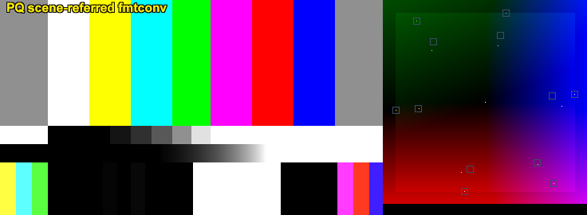

   PQ scene-referred — fmtconv (32-bit float).

   PQ scene-referred — fmtconv (16-bit integer; Cyan/Green at ~50% radius).

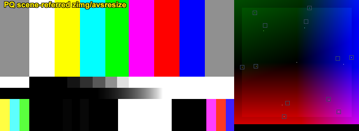

   PQ scene-referred — zimg/avsresize (full-range RGBP output).

   PQ scene-referred — zimg/avsresize (limited-range RGBP output, broken).

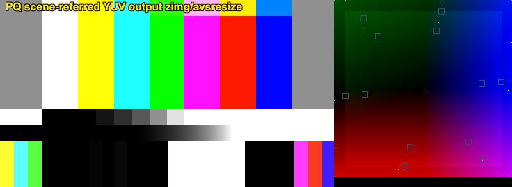

   PQ scene-referred — zimg/avsresize YUV444P10 output (overflow artefacts on saturated primaries).

   PQ display-referred — fmtconv (32-bit float).

   PQ display-referred — zimg/avsresize (full-range RGBP output).

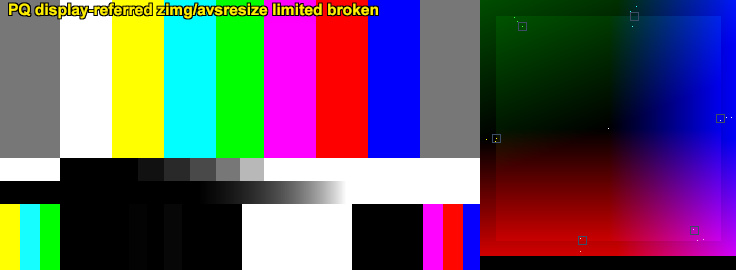

   PQ display-referred — zimg/avsresize (limited-range RGBP output, broken).

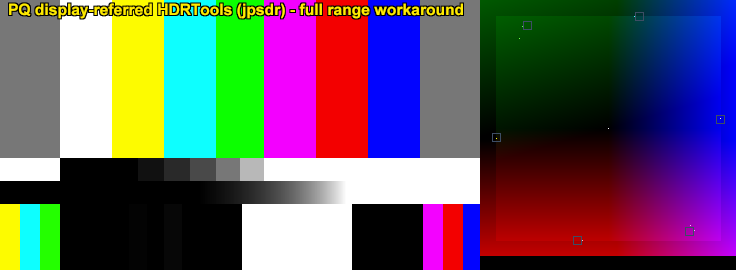

   PQ display-referred — HDRTools (full-range 16-bit workaround).

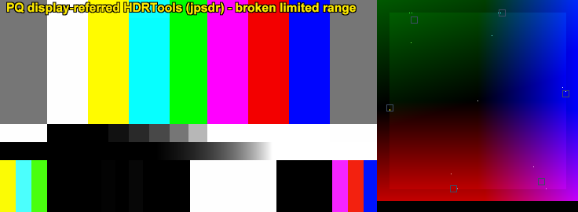

   PQ display-referred — HDRTools (limited-range input, broken).

|clearfloat|

HDR Reference White and the 203 cd/m² Value
-------------------------------------------

Both PQ and HLG share a common *HDR reference white* — the luminance level
that corresponds to diffuse white (a 100% reflectance card) in the HDR signal,
and which is mapped to SDR white (1.0 = 100 cd/m²) during HDR-to-SDR
conversion.  The exact numeric value of this anchor depends on which standard
is being consulted, and at what arithmetic precision the underlying formula is
evaluated.

Base Formula (HLG)
^^^^^^^^^^^^^^^^^^

The value originates from the HLG system.  BT.2100-3 defines the HLG OETF
inverse for signal levels ``E' >= 0.5`` as::

    E  = exp((E' - c) / a) / 12  +  b / 12

with constants (BT.2100-3, Note 5c)::

    a = 0.17883277
    b = 1 - 4a         = 0.28466892
    c = 0.5 - a*ln(4a) = 0.55991073

HLG reference white sits at signal level ``E' = 0.75``.  Display luminance
follows from the HLG OOTF with system gamma ``γ = 1.2`` (nominal 1000 cd/m²
peak) and peak luminance ``L_W = 1000 cd/m²``::

    F_D = L_W * OETF^-1(0.75)^γ
        = 1000 * E^1.2

For PQ the value is adopted directly — BT.2408 designates the same luminance
as the shared diffuse-white anchor for both systems.  The oft-cited "58% PQ"
figure is simply ``PQ_OETF(203 cd/m²) ≈ 0.5807`` rounded; it is a consequence
of the 203 cd/m² definition, not a definition in its own right.

Precision Variants
^^^^^^^^^^^^^^^^^^

Evaluating the formula above at different arithmetic precisions, and rounding
intermediate results as different standards and tools do, yields a family of
slightly different values:

.. list-table::
   :header-rows: 1
   :widths: 32 18 18 32

   * - Source
     - F_D (cd/m²)
     - Coeff (10000/F_D)
     - Notes
   * - BT.2408 (operational guideline)
     - 203.0
     - 49.2611
     - Rounded integer; human-readable mastering target
   * - BT.2111-3 (HDR colour bars)
     - 203.15
     - 49.2247
     - Explicitly stated; more precise than BT.2408
   * - Double precision (64-bit)
     - 203.1521
     - 49.2242
     - Full evaluation of BT.2100-3 constants
   * - Float32 strict
     - 203.1522
     - 49.2242
     - Differs from double by < 0.0001 cd/m²; operationally identical

BT.2408 rounds to a whole number because a 0.15 nit difference is
imperceptible in a mastering suite.  BT.2111-3 uses 203.15 because its
colour-bar definitions require the value to be mathematically consistent across
PQ and HLG signal levels to more decimal places, but it does not carry the
full precision of the BT.2100-3 formula.  The remaining gap between 203.15
and 203.1521 (roughly 0.002 cd/m²) is below any meaningful display or grading
threshold and arises purely from how many decimal places of the BT.2100-3
constants were retained before rounding.

Chosen Values For Test Scripts
^^^^^^^^^^^^^^^^^^^^^^^^^^^^^^

.. list-table::
   :header-rows: 1
   :widths: 40 15 45

   * - Parameter
     - Value
     - Rationale
   * - zimg / avsresize ``nominal_luminance``
     - 203.15
     - Matches the value explicitly stated in BT.2111-3.  Provides more
       precision than the BT.2408 integer while resting on a direct standard
       reference rather than a computed approximation.
   * - HDRTools ``Coeff_X`` / ``Coeff_Y`` / ``Coeff_Z``
     - 49.2242
     - Derived as ``1.0 / 0.0203152`` (= ``10000 / 203.1521``), the
       double-precision result of the BT.2100-3 formula.  Float32 evaluation
       yields the same four significant figures, so precision mode is not a
       factor.

Changelog
---------

+------------------+----------------------------------------------------------+
| Version          | Changes                                                  |
+==================+==========================================================+
| AviSynth+ 3.7.6  | Initial release of ColorBarsUHD. Implements              |
|                  | ITU-R BT.2111-3 (05/2025) with three signal variants:    |
|                  | HLG narrow range (mode=0), PQ narrow range (mode=1),     |
|                  | and PQ full range (mode=2). Supports RGBP10/12 as        |
|                  | primary formats plus 8/14/16-bit integer, 32-bit float,  |
|                  | and YUV444 output. Height auto-derived from width.       |
|                  | All frame properties set automatically.                  |
+------------------+----------------------------------------------------------+

References
----------

* `Rec. ITU-R BT.2111-3`_: Reference service-level HDR colour bar test patterns.
* `Rec. ITU-R BT.2100`_: Image parameter values for high dynamic range television for use in production and international programme exchange.
* `Rec. ITU-R BT.2020`_: Parameter values for ultra-high definition television systems for production and international programme exchange.
* `Rec. ITU-R BT.1886`_: Reference electro-optical transfer function for flat panel displays used in HDTV studio production.
* `Rec. ITU-R BT.2087`_: Colour conversion from Recommendation ITU-R BT.709 to Recommendation ITU-R BT.2020.
* `Rec. ITU-R BT.814`_: Specifications of PLUGE test signals and alignment procedures for setting of brightness and contrast of displays.
* `fmtconv (AviSynth wiki)`_: AviSynth wiki page for the fmtconv plugin.
* `fmtconv documentation`_: Full HTML reference documentation for fmtconv.
* `fmtconv releases (GitLab)`_: fmtconv source releases on GitLab.
* `avsresize (AviSynth wiki)`_: AviSynth wiki page for avsresize (zimg wrapper).
* `avsresize (Codeberg)`_: avsresize source repository on Codeberg.
* `zimg (GitHub)`_: zimg scaling and colour space conversion library.
* `HDRTools (AviSynth wiki)`_: AviSynth wiki page for HDRTools (jpsdr).
* `HDRTools (GitHub)`_: HDRTools source repository on GitHub.

.. _Rec. ITU-R BT.2111-3:
    https://www.itu.int/rec/R-REC-BT.2111/en
.. _Rec. ITU-R BT.2100:
    https://www.itu.int/rec/R-REC-BT.2100/en
.. _Rec. ITU-R BT.2020:
    https://www.itu.int/rec/R-REC-BT.2020/en
.. _Rec. ITU-R BT.1886:
    https://www.itu.int/rec/R-REC-BT.1886/en
.. _Rec. ITU-R BT.2087:
    https://www.itu.int/rec/R-REC-BT.2087/en
.. _Rec. ITU-R BT.814:
    https://www.itu.int/rec/R-REC-BT.814-4-201807-I/en
.. _fmtconv (AviSynth wiki):
    http://avisynth.nl/index.php/Fmtconv
.. _fmtconv documentation:
    https://htmlpreview.github.io/?https://github.com/EleonoreMizo/fmtconv/blob/master/doc/fmtconv.html
.. _fmtconv releases (GitLab):
    https://gitlab.com/EleonoreMizo/fmtconv/-/releases
.. _avsresize (AviSynth wiki):
    http://avisynth.nl/index.php/Avsresize
.. _avsresize (Codeberg):
    https://codeberg.org/StvG/avsresize
.. _zimg (GitHub):
    https://github.com/sekrit-twc/zimg/
.. _HDRTools (AviSynth wiki):
    http://avisynth.nl/index.php/HDRTools
.. _HDRTools (GitHub):
    https://github.com/jpsdr/HDRTools

.. |clearfloat|  raw:: html

    

    
$Date: 2026/03/28 00:00:00 $